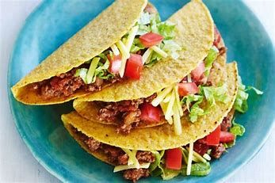

# MY MARKDOWN CHEAT SHEET

Mark down is basically the same thing as mark up but with few changes

It contains multi levels of heading but just from H1 to H5 and they are represented by a #

# H1 heading

## H2 heading

### H3 heading

#### H4 heading

##### H5 heading

This is a Paragraph it doesn't require anything special all you do is just type out what you want.

## LISTS

Lists can be created as well Ordered and Unordered lists

### ORDERED LISTS

To create an ordered list just type a number before the list item

1. number 1
2. number 2
3. number 3
4. number 4

### UN-ORDERED LISTS

this list is created using a dash (-) or an asterisk (\*)

- list item

* list item
  - nested list item

## LINKS

links can be added as thus

[Name to be displayed](actual.url)

## MEDIA FILES

Images/vides/gifs are added the same way as links are added but they dont display unless called and that can be done by adding an exclamation mark

[image would display when clicked](./../images/pexels-karen-la%C3%A5rk-boshoff-9980749.jpg)



## TABLES

Tables are created as thus

| Row a  | Row b  |
| ------ | ------ |
| Col 1a | Col 1b |
| Col 2a | Col 2b |

The table head is above the line and the table data is below the line.

## FORMATING TEXT

Text can be made to appear **BOLD** by adding two asterisks before and after the text (\*\*) or made to appear in _ITALICS_ by adding (\_) before and after the text

` This is a Code block - Created by putting a text in a backticlk`

```
This is a multi-line code block created by wrapping the text in-between 3 backtics at each end
```

    This is a tab it formats text like a code block

### QUOTE

A quote is created by using greater than symbol and typing

> This is a quote
>
> This is another quote
